# ANSYS-Fluent-Internal-Flow-Analysis

Performed CFD simulations of flow through curved ducts, a 40-degree conical diffuser, and a converging-diverging nozzle using ANSYS Fluent. Conducted mesh-independence studies and analyzed velocity distributions, pressure losses, and flow separation. MATLAB was used for plotting and comparison with theoretical results.

# Computational Fluid Dynamics (CFD) Analysis of Internal Flows

**Numerical investigation of internal-flow behavior in curved pipes, a conical diffuser, and a converging–diverging nozzle using ANSYS Fluent and MATLAB.**

## Project Overview

This project investigates three internal-flow configurations using computational fluid dynamics (CFD). The objective is to understand how geometry, flow conditions, and boundary effects influence velocity distributions, pressure variations, flow separation, and energy losses.

The numerical investigation combines simulations in **ANSYS Fluent** with analytical post-processing and visualization in **MATLAB**. Selected velocity and pressure distributions, flow profiles, and streamlines are examined to interpret the underlying fluid-mechanics phenomena.

## Project Scope

| Study | Geometry                                              | Main objectives                                                                           |
| ----- | ----------------------------------------------------- | ----------------------------------------------------------------------------------------- |
| 1     | 90° pipe elbow                                        | Investigate velocity profiles, pressure variation, curvature effects, and pressure losses |
| 2     | 40° conical diffuser                                  | Examine flow deceleration, pressure recovery, and possible flow separation                |
| 3     | Elbow with guide vane and converging–diverging nozzle | Analyze velocity, pressure, temperature, density, and mass-flow behavior                  |

## Tools and Methods

* **ANSYS Fluent** — CFD simulation and flow-field visualization
* **MATLAB** — Numerical post-processing, data analysis, and plotting
* **Computational Fluid Dynamics (CFD)** — Numerical analysis of internal flows
* **Finite Volume Method (FVM)** — Numerical framework used in Fluent
* **Mesh generation and quality assessment** — Spatial discretization of computational domains
* **Conservation checks** — Evaluation of mass-flow consistency
* **Comparative analysis** — Examination of results obtained using different numerical approaches

---

## 1. Flow Through a 90° Pipe Elbow

The first study examines flow through a 90° elbow under different Reynolds numbers and curvature ratios.

The investigation considers both laminar and turbulent flow conditions, with Reynolds numbers of 500 and 10,000, and compares elbow geometries with curvature ratios of \(R/D=2\) and \(R/D=4\).

### Geometry & Mesh

  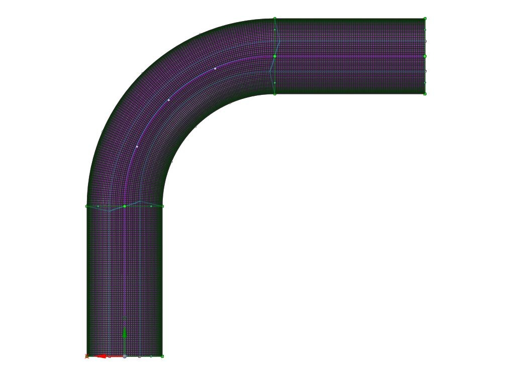
  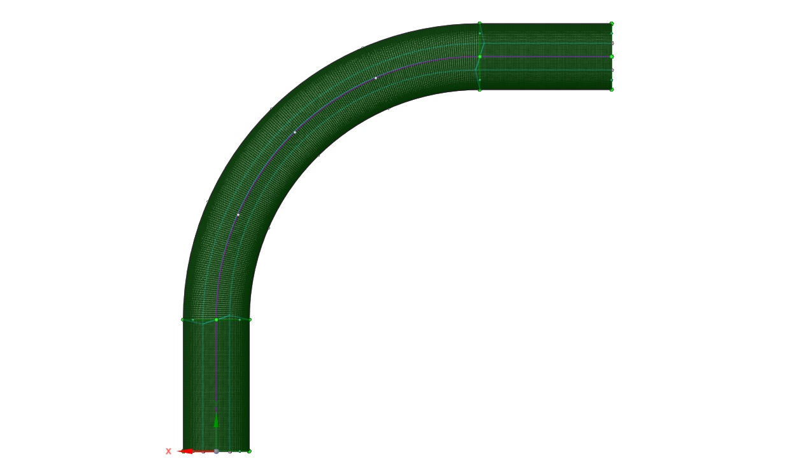

<em>Structured meshes for the 90° elbows with R/D = 2 (left) and R/D = 4 (right).</em>

### Velocity & Pressure Fields

  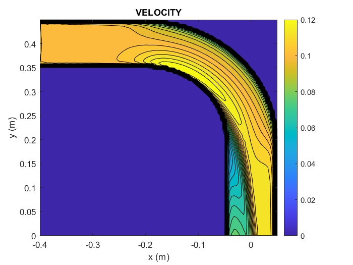
  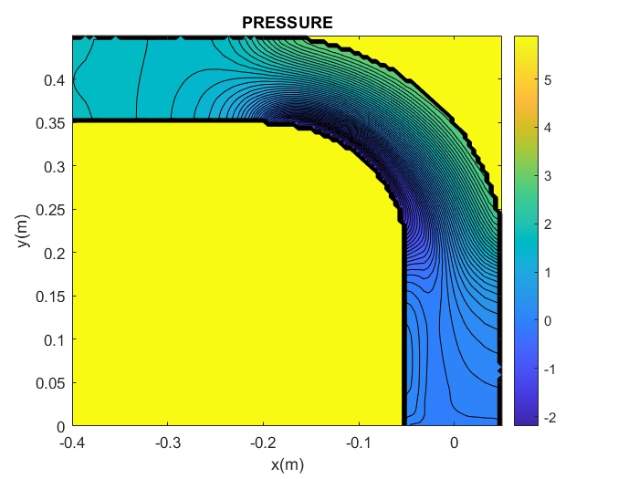

<em>Velocity magnitude (left) and static-pressure (right) contours on the mid-plane (MATLAB post-processing).</em>

### Objectives

* Examine the effect of curvature on the velocity distribution.
* Analyze pressure variation along the pipe.
* Investigate secondary flow and possible separation near the bend.
* Compare velocity and pressure distributions obtained from Fluent and MATLAB.
* Evaluate the influence of Reynolds number and elbow curvature on the flow field.

### Key Physical Phenomena

Flow turning introduces centrifugal effects and modifies the velocity distribution across the pipe. Depending on the Reynolds number and geometry, the bend may produce nonuniform velocity profiles, secondary motion, and additional pressure losses.

The comparison between different curvature ratios helps illustrate the relationship between geometry and internal-flow behavior.

---

## 2. Flow Through a 40° Conical Diffuser

The second study investigates flow through a conical diffuser, where the cross-sectional area increases in the streamwise direction (inlet diameter 0.08 m → outlet diameter 0.16 m, included angle 40°).

### Geometry & Mesh

  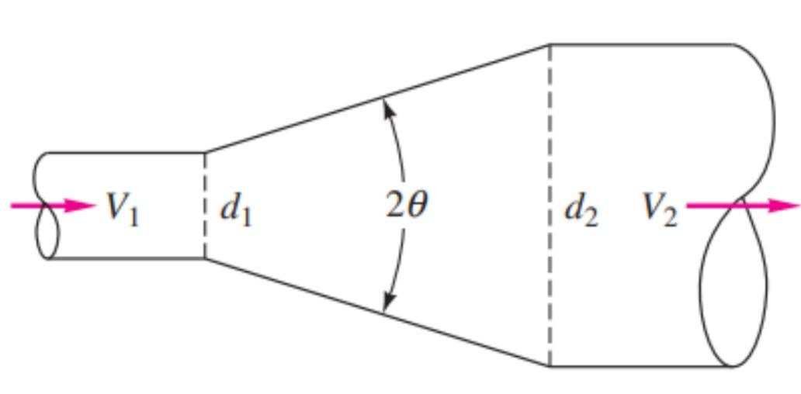
  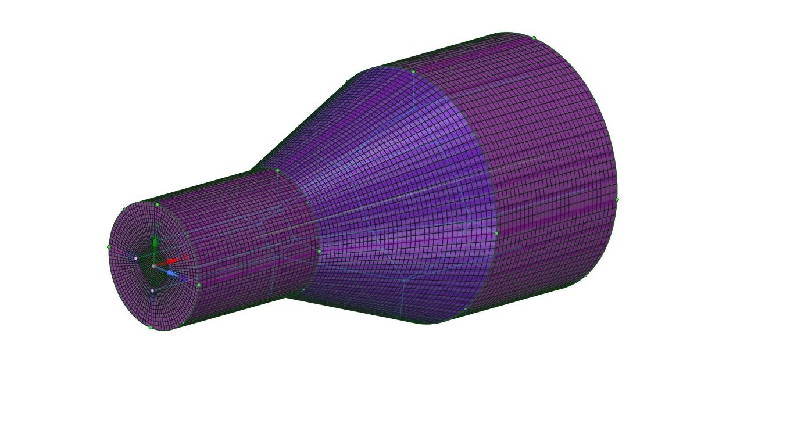

<em>Schematic of the conical diffuser (left) and the structured 3-D mesh (right).</em>

### Velocity Contour & Streamlines

  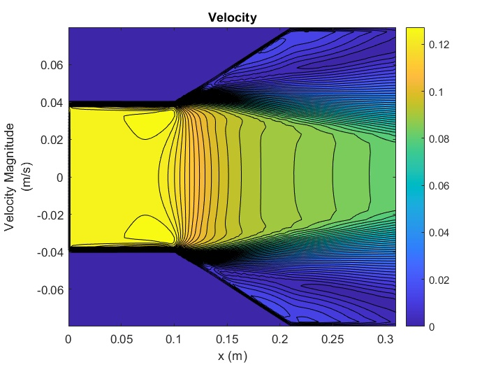
  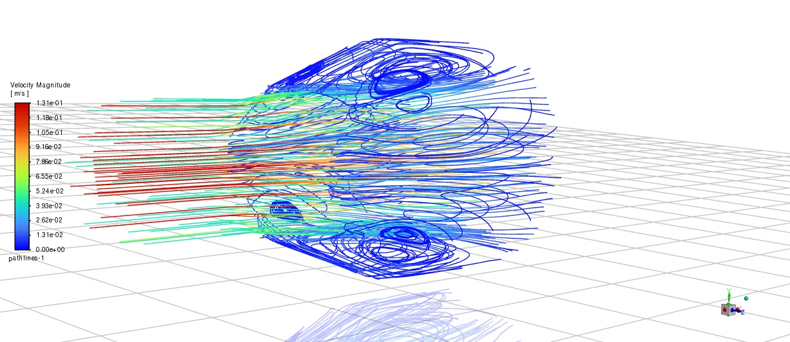

<em>Velocity contour showing core deceleration and near-wall recirculation (left) and 3-D streamlines (right).</em>

### Objectives

* Examine velocity reduction through the expanding section.
* Investigate static-pressure variation along the diffuser.
* Analyze velocity profiles at selected cross-sections.
* Visualize velocity and pressure contours.
* Identify flow nonuniformity and possible recirculation regions.
* Compare numerical results and assess their physical consistency.

### Key Physical Phenomena

As the flow passes through an expanding duct, its mean velocity decreases and static pressure may recover. However, the adverse pressure gradient can cause boundary-layer thickening or separation, depending on the diffuser geometry and inlet-flow conditions. The obtained pressure-recovery coefficient \(C_r \approx 0.576\) lies within the expected empirical range for a 40° diffuser with strong separation.

---

## 3. Elbow–Guide-Vane–Converging–Diverging Nozzle System

The third study examines a more complex flow domain combining a curved passage, a guide vane, and a converging–diverging nozzle. Air enters at 0.8 m/s and 600 K; walls are held at 250 K. Density varies with temperature.

### Geometry

  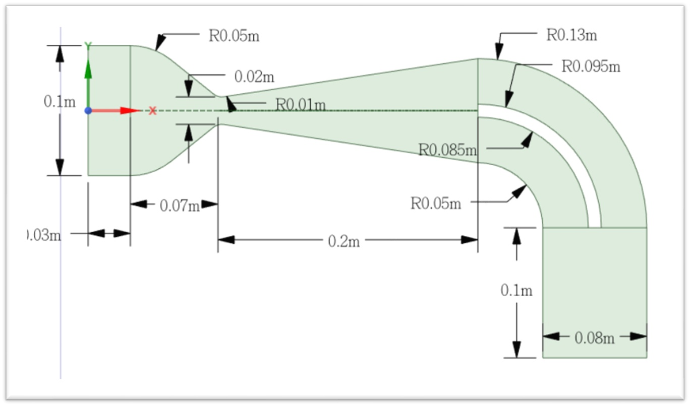

<em>Geometry and key dimensions of the converging–diverging nozzle with elbow and guide vanes.</em>

### Flow-Field Contours

  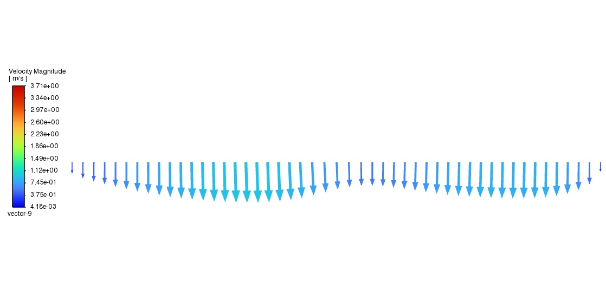
  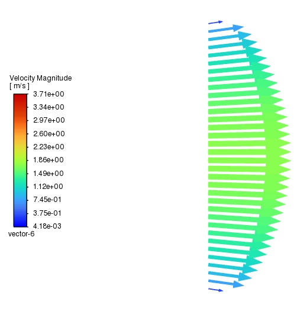

  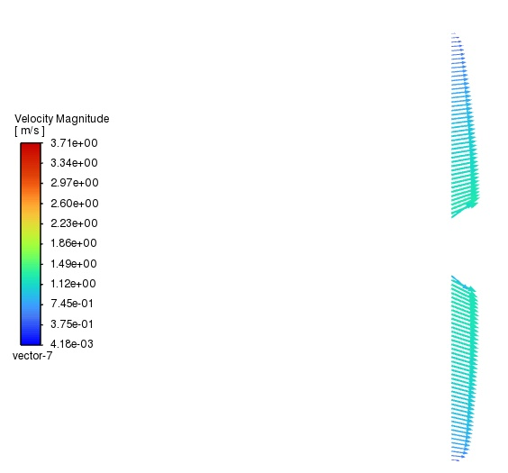
  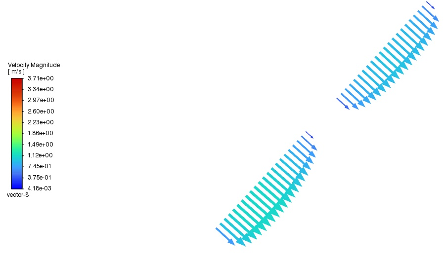

<em>Velocity, pressure, temperature and density contours of the coupled nozzle system.</em>

### Centerline Behavior & Mass Balance

  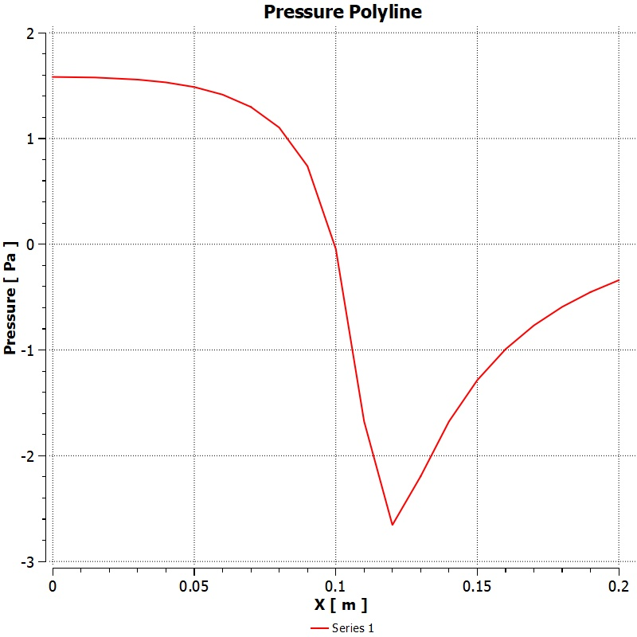
  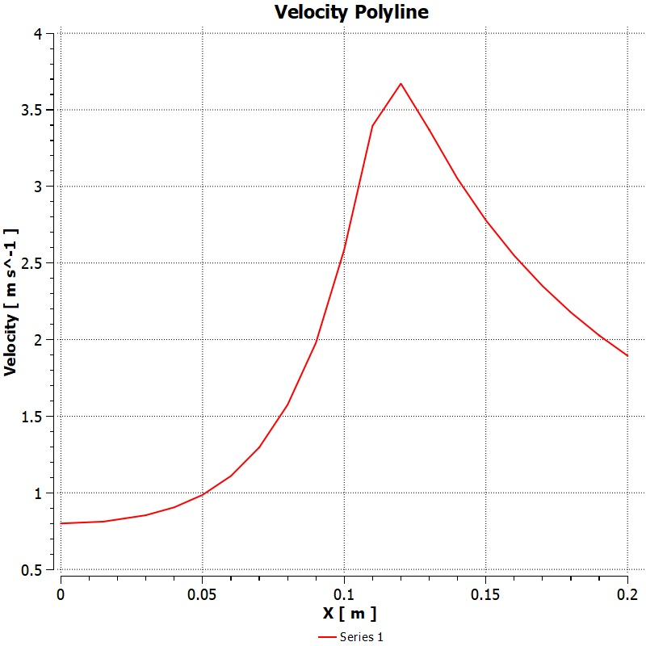

<em>Centerline pressure and velocity distributions (peak velocity ≈ 3.6 m/s near the throat).</em>

### Objectives

* Examine velocity redistribution through the curved and variable-area passages.
* Investigate pressure changes along the flow direction.
* Analyze temperature and density distributions.
* Extract velocity and pressure profiles at selected locations.
* Visualize streamlines and identify regions of complex flow behavior.
* Evaluate mass-flow rates at the inlet and outlets.
* Check mass conservation and assess the guide-vane outlet flow.

### Mass Conservation

The mass-flow balance is evaluated by comparing the inlet mass flow rate with the sum of the outlet mass flow rates:

$$
\sum \dot{m}_{\mathrm{in}} - \sum \dot{m}_{\mathrm{out}} \approx 0
$$

A small imbalance (on the order of 1.7 g/s) supports the numerical consistency of the converged solution.

---

## Numerical Analysis and Validation

The project emphasizes the importance of checking numerical results before drawing physical conclusions.

The main assessment considerations include:

* **Mesh quality:** Evaluating the computational grid and its suitability for resolving flow gradients.
* **Convergence:** Examining solver convergence and the stability of the reported flow quantities.
* **Conservation:** Checking mass-flow consistency across the computational domain.
* **Cross-method comparison:** Comparing selected Fluent results with MATLAB calculations and visualizations.
* **Physical interpretation:** Relating velocity and pressure distributions to established internal-flow principles.

## Main Engineering Insights

* Curved passages modify velocity profiles and introduce additional flow structures; smaller \(R/D\) increases separation near the inner wall.
* Diffusers convert part of the flow’s kinetic energy into static pressure, while viscous effects and separation can limit pressure recovery.
* Variable-area nozzle systems produce substantial spatial changes in velocity and pressure.
* Thermal and density fields provide additional insight into flows involving temperature variation.
* Mass conservation and numerical checks are essential when interpreting CFD results.
* Comparing Fluent outputs with MATLAB post-processing helps connect numerical predictions with fluid-mechanics theory.

## MATLAB Scripts

Post-processing scripts used to generate contours, profiles, and comparative plots:

* **[Elbow](matlab/elbow)** — Velocity/pressure profiles and contours for the 90° elbows
* **[Diffuser](matlab/diffuser)** — Velocity/pressure fields and recovery analysis for the 40° conical diffuser
* **[Nozzle](matlab/nozzle)** — Velocity, pressure, temperature, density, and mass-flow post-processing for the converging–diverging nozzle system
## Project Reports

The accompanying reports document the problem definitions, computational procedures, flow-field visualizations, and engineering interpretations for the three studies.

| Report | Description | File |
|--------|-------------|------|
| **English Portfolio Report** | Concise English edition summarizing methods, key results, and conclusions | [`Internal_Flow_CFD_Analysis_English_Report.pdf`](reports/Internal_Flow_CFD_Analysis_English_Report.pdf) |
| **Persian Course Report** | Full original report (Sharif University of Technology – Fluid Mechanics 1) | [`Internal_Flow_CFD_Analysis_Farsi_Report.pdf`](reports/Internal_Flow_CFD_Analysis_Farsi_Report.pdf) |
